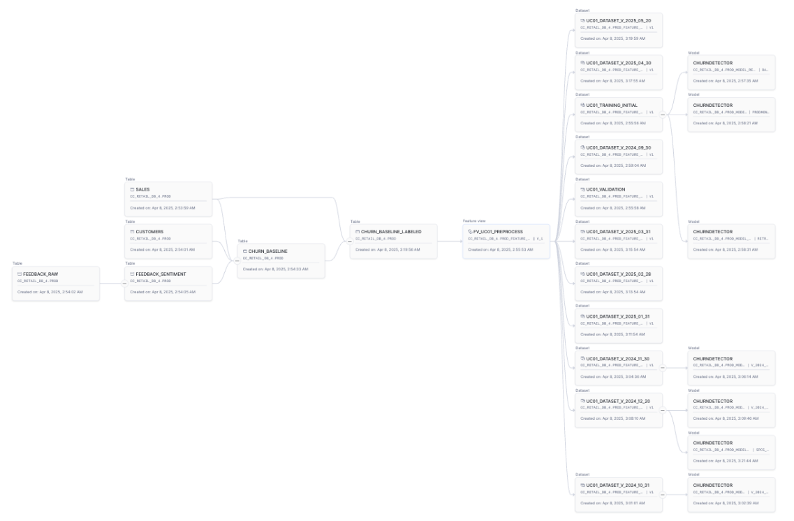

# End-to-End ML with Observability Demo

This setup show how to use Snowflake Model Monitors to track Model performance and detect drift. It simulates a sales cycle where every month new sales data, together with customer feedback in natural language is recevied. Goal is to create a model that can detect whether customer will be buying again in the next month, and detect those with the highest probability of not buying again.

Labels are updated everytime new records are added, so we can compare the prediction that was done by the model with the real value. Model Monitor helps tracking performance.

Base on the performance of the model it triggers the training of a new model.

The notebook shows end to end how to build models within Snowflake. It uses

- Snowflake Notebook with Container Runtime
- Cortex AI to process customer sentiment from text
- Streams to detect and process new records
- Snowpark Analytical Functions to create new features that profile customer sales
- Feature Store to manage features used
- Datasets to persist data used by models
- Model Registry to manage models lifecycle
- Snowpark Container Services to provide online endpoint inference
- Model Monitor to track model performance and detect data drift
- Model Lineage

