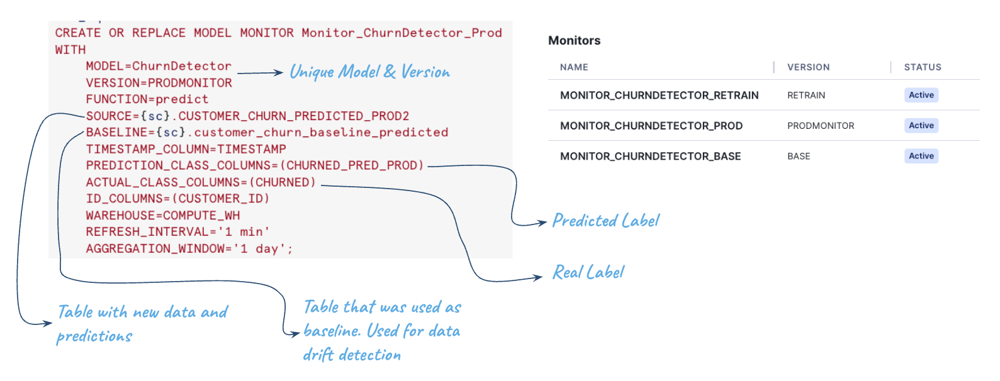

# End-to-End ML with Observability Demo

This setup show how to use Snowflake Model Monitors to track Model performance and detect drift. It simulates a sales cycle where every month new sales data, together with customer feedback in natural language is recevied. Goal is to create a model that can detect whether customer will be buying again in the next month, and detect those with the highest probability of not buying again.

Labels are updated everytime new records are added, so we can compare the prediction that was done by the model with the real value. Model Monitor helps tracking performance.

Base on the performance of the model it triggers the training of a new model and select what is the next model to use.

The notebook shows end to end how to build models within Snowflake. It does:

- Ingest Sales, Customers, Customer Reviews/feedback monthly data
- Use Cortex AI to extract sentiment from reviews
- Use Snowflake Analytical Functions to create features that describe customer behavior 
- Serve Datasets from the  Feature Store
- Train Models using Container Runtime
- Log models with Model Registry and manage model lifecycle
- Use Model Monitor to detect performance and data drift
- Set Alarms to detect performance drift

The end result will be having end-to-end models with full lineage:

Let's review the steps taken:

## Setup
### Generate sales, feedback and customer data

You have to run 4_0_GENERATE_DS Notebook. We are in the process of having the files in a S3 location so you can avoid this step. But we keep it there in case you want to modify how to generate data for your own use case

### Create some UTILS Stored Procedures

Notebook 4_1_FUNCTIONS generate functions for doing Feature Engineering and Labeling. We have separated those just to demo how you can integrate SPs in your procedures.

## Main Notebook

The notebook 4_3_STREAMS_TRAINING contains all the steps described above. Let's review some of them:

### Process Feedback Sentiment

Here we are using the power of LLMs to process unstructured data and get a metric about the sentiment of the customer feedback. In this case we use the sentiment() function. This shows how LLMs can be easily used in your data pipelines. We also take advantage of Snowflake Streams to just process the new sentiment records received:

### Feature Engineering

We want to create a profide of the customer behavior, where we can understand how customer is buying. Here we can use the power of Snowflake Analytical functions to sum and count the total amount purchased in the last 7 days, last 1, 2 and 3 months. We also create metrics for the minimum and average value of the feedback provided (sentiment) for the last 2, 3 and 4 messages received:

### Modeling, Labeling & Inference

One of the key things of these models, is that we receive the data (sales) and we can make a prediction (in this case if the customer will buy again in the next 30 days). After a period of time, when we receive the new data, we can check if that prediction was correct or not. So we can understand the real performance of the models we are using. That is the dataset we are going to be use, together with Model Monitoring to asses the performance of the models and choose which one should be used for the next prediction.

The notebook also shows different ways to perform Model Training, altough we are using OSS packages within Container Runtime for simplicity.

### Datasets

Datasets are a key component of the Feature Store, as they persist and provide lineage for the data used by the Models. We can identify and retrieve again the dataset used to train specific models. Previous datasets are also used once a model is re-trained to measure peformance on past data.

### Register Models within the Model Registry

We use the Model Registry to store the models and retrieve them later for inference. We also use it to govern the model cycle, promoting one of them as default one used for production inference. 

### Model Monitor

In this demo we are going to create 3 model monitors that are associated to the predictions we are monitoring. Model Monitors are very helpful to get out of the box metrics that help us to understand the model performance. Metrics are calculated automatically and alwasy up to date according to their REFRESH_INTERVAL.

We indicate the SOURCE table where we are storing predictions, the BASELINE which is the first table we used to train the model. This is important to detect any value drift.

For each Model Monitor we specify the columns with the real and the predicted label. 

In this demo, all models are storing predictions in the same table with different column names.

### Model Monitor Metrics

We have created a function to calculate and return metrics. This is used to measure performance for models on the new labeled data. Main metric used in the demo is F1_SCORE but all these are available as of today:

### Workflow

These are the steps taken within process_one_month() function. This could be separated in different tasks and orchestrated in different ways, using for example streams and tasks or DAG within Snowflake or any external tool. For simplicity and educational purposes we keep this in a single function for now. The steps taken:

1. Ingest a new month of data
2. Process sentiment
3. Perform feature engineering for the latest timestamp (latest sale)
4. Set the correct labes: with the new data, we can go back and set the right labels
5. Generate a new dataset with the new data ingested
6. Test the performance of the BASE and the current default (prod) model
7. If performance is bellow a threshold, train a new model
8. Measure the performance of the new model on the labeled data.
9. From the three models, choose the best performance and make it default
10. Run inference using the choosen model (default)
11. Remove old datasets and models no needed (this is note implemented in the notebook)

### Model Observability

We can also use Snowsight -> Models -> Monitors to see the models performance. In our case, we can see how there is a drift in performance and a new model trained improve it. At the same time, we can see how there is a data drift that very probably has originated that change in the peformance. 

### Alerts

We can also use Model Monitor to set Alerts. These can take actions like call other scritps (re-train), send email, or as in the example, just insert a record in a table.

### Cortex AI & Streamlit to Understand Customer Feedback

As a bonus, we can use again Cortex AI to provide a summary from customers. We have classify those with the highest probability of not buying again, and a support assistant can use it to understand the different metrics.

